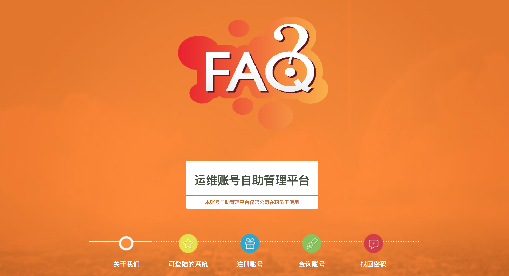
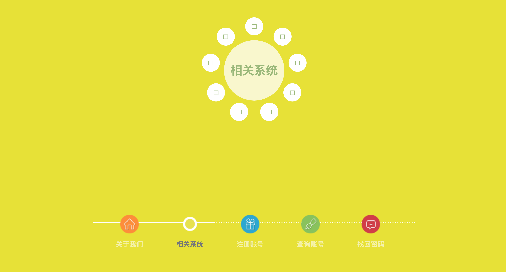
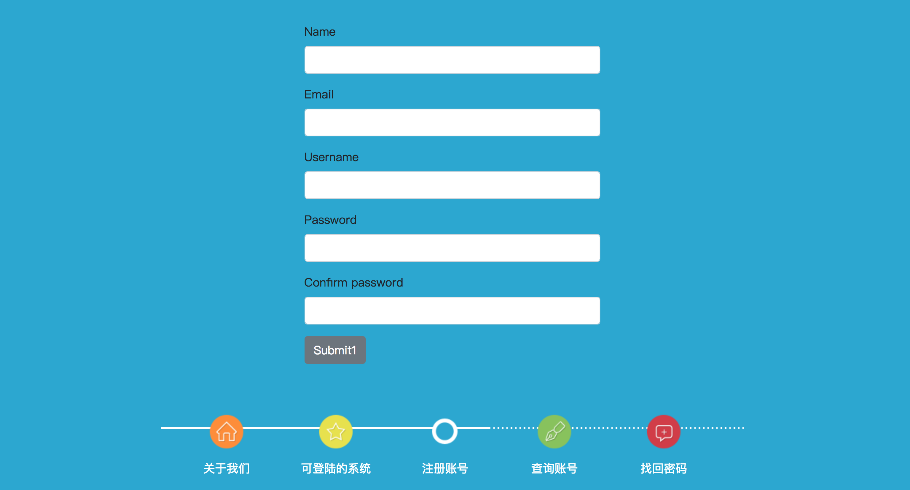
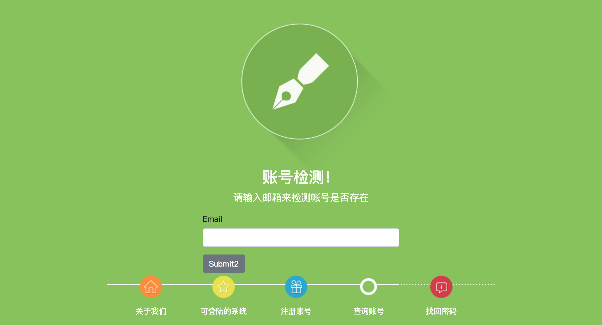
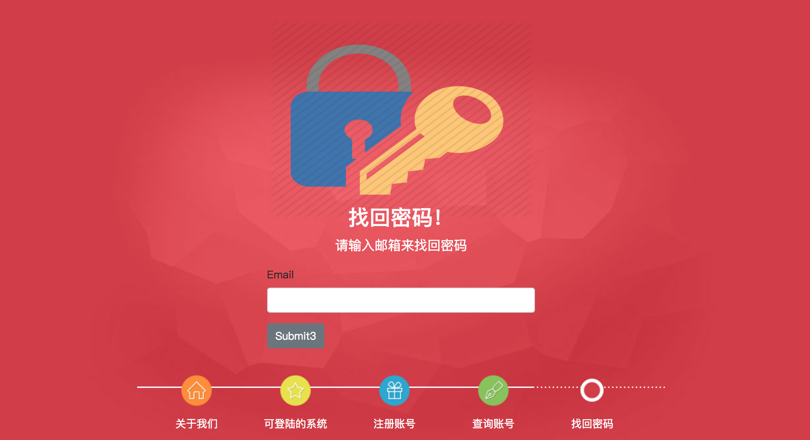

dingtalk2ldap
=============


[TOC]

[](https://www.python.org/)
[](http://flask.pocoo.org/)
[](https://docs.pipenv.org/)


### 一、Installation

```python
$ git clone https://github.com/zhuima/dingtalk2ldap.git
$ cd dingtalk2ldap
$ pipenv install --dev
$ pipenv shell
$ pipenv run flask run
* Running on http://127.0.0.1:5000/
```


### 二、关于项目

- 为了减轻运维手动操作，此乃自助注册平台，通过企业邮箱实现
- 自助，自助，自助


### 三、实现机制

- 用户注册账号并确认后实现同步到管理系统里


### 四、DEMO

#### 4.1、首页



#### 4.2、关联系统



#### 4.3、注册页面



#### 4.4、账号监测页面



#### 4.5、密码找回页面



### 五、TODO

- [ ] dingding
- [ ] 权限管理
- [ ] 后台优化扩展